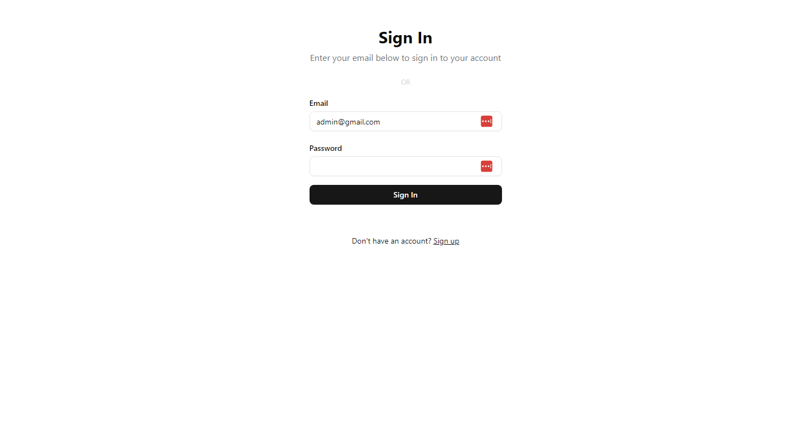

# Next.js 15 Auth con Cache de Sesiones


Una implementación robusta y moderna de autenticación en Next.js 15 utilizando Auth.js (anteriormente NextAuth) con almacenamiento en caché de sesiones mediante Upstash Redis.

<!-- Imagen de la aplicación: -->



## 🚀 Características

- ⚡ Autenticación moderna con Next.js 15 y App Router
- 🔐 Sistema de autenticación completo con Auth.js 5
- 📦 Caché de sesiones con Upstash Redis
- 🎨 UI moderna con Tailwind CSS
- 📱 Diseño responsivo
- 🔒 Manejo seguro de credenciales
- 🌐 Soporte para modo oscuro
- ⚛️ Construido con React 19

## 📋 Prerrequisitos

- Node.js 18.0 o superior
- Una cuenta en [Upstash](https://upstash.com/) para Redis
- Conocimientos básicos de Next.js y TypeScript

## 🛠️ Instalación

1. **Clonar el repositorio**

```bash
git clone <url-del-repositorio>
cd <nombre-del-proyecto>
```

2. **Instalar dependencias**

```bash
bun install
```

3. **Configurar variables de entorno**
   Crea un archivo `.env` en la raíz del proyecto:

```env
AUTH_SECRET="tu-secreto-seguro"
UPSTASH_REDIS_REST_URL="tu-url-de-upstash"
UPSTASH_REDIS_REST_TOKEN="tu-token-de-upstash"
```

4. **Iniciar el servidor de desarrollo**

```bash
bun run dev
```

## 🏗️ Estructura del Proyecto

```
├── app/
│   ├── api/
│   │   └── auth/
│   │       └── [...nextauth]/
│   ├── libs/
│   │   ├── auth.ts
│   │   ├── credentials.ts
│   │   ├── providers.ts
│   │   ├── redis.ts
│   │   └── types.ts
│   ├── globals.css
│   ├── layout.tsx
│   └── page.tsx
├── public/
├── .env
├── next.config.ts
├── package.json
├── tailwind.config.ts
└── tsconfig.json
```

## 🔧 Tecnologías Principales

- **Next.js 15.1.7**: Framework de React para producción
- **Auth.js 5.0**: Sistema de autenticación moderno
- **Upstash Redis**: Almacenamiento en caché distribuido
- **TypeScript**: Tipado estático para JavaScript
- **Tailwind CSS**: Framework de CSS utilitario
- **React 19**: Biblioteca UI
- **nanoid**: Generación de IDs únicos

## 🔐 Características de Autenticación

- Autenticación con credenciales
- Sesiones JWT
- Almacenamiento en caché con Redis
- Funciones de hash seguras para contraseñas
- Tokens aleatorios seguros
- Verificación de email (opcional)

## 📚 API y Endpoints

### Rutas de Autenticación

Las principales rutas de autenticación del proyecto son:

#### Rutas de Cliente

- `/signin` - Página de inicio de sesión (`app/signin/page.tsx`)
- `/signup` - Página de registro (`app/signup/page.tsx`)
- `/profile` - Página de perfil del usuario (`app/profile/page.tsx`)
- `/dashboard` - Panel de control (`app/dashboard/page.tsx`)
- `/settings` - Configuración de cuenta (`app/settings/page.tsx`)

#### Rutas de API

- `/api/auth/[...nextauth]` - Endpoints de Auth.js (`app/api/auth/[...nextauth]/route.ts`)
  - POST `/api/auth/signin` - Iniciar sesión
  - POST `/api/auth/signup` - Registrar usuario
  - GET `/api/auth/session` - Obtener sesión actual
  - POST `/api/auth/signout` - Cerrar sesión

#### Rutas Protegidas

Todas las rutas bajo `/dashboard/*` y `/settings/*` requieren autenticación. El middleware de Auth.js (`middleware.ts`) se encarga de proteger estas rutas y redirigir a los usuarios no autenticados.

#### Manejo de Estado

El estado de autenticación se puede acceder desde cualquier componente usando los hooks de Auth.js

## 🎨 Personalización

### Estilos

El proyecto utiliza Tailwind CSS con soporte para modo oscuro y claro. Los estilos principales se encuentran en:

- `app/globals.css`
- `tailwind.config.ts`

### Fuentes

- Geist Sans: Fuente principal
- Geist Mono: Fuente para código

## 🚀 Despliegue

El proyecto está optimizado para despliegue en Vercel:

```bash
bun run build
vercel deploy
```

## 🔍 Scripts Disponibles

- `npm run dev`: Inicia el servidor de desarrollo
- `npm run build`: Construye la aplicación para producción
- `npm run start`: Inicia el servidor de producción
- `npm run lint`: Ejecuta el linter

## 🤝 Contribución

Las contribuciones son bienvenidas. Por favor, sigue estos pasos:

1. Fork el proyecto
2. Crea una rama para tu característica (`git checkout -b feature/AmazingFeature`)
3. Commit tus cambios (`git commit -m 'Add some AmazingFeature'`)
4. Push a la rama (`git push origin feature/AmazingFeature`)
5. Abre un Pull Request

## 📄 Licencia

Este proyecto está bajo la Licencia MIT. Ver el archivo `LICENSE` para más detalles.

## 📧 Contacto

Tu Nombre - [@Play10Never](https://x.com/Play10Never)

Link del Proyecto: [https://github.com/Lostovayne](https://github.com/LostoVayne)
